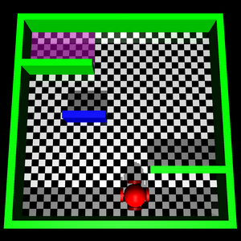

# A Motion Planner Based on the Prediction Using LSTM Autoencoder

### Introduction:

In this project, we propose a motion planer using LSTM autoencoder to predict future information
and RRG to plan a motion policy based on that information. We construct a maze problem to test our idea and prove that our planning algorithm can obtain valid motion policies as expected.

This project is originally based on our course project for CS 6140 Machine Learning by Prof. Predrag Radivojac, Fall 2019, at Northeastern University Khoury College of Computer Sciences. 

More work is ongoing.

  

### Development Environment:

- Python 3.7.5
- C++ 11

### Dependency:

- MuJoCo 200
- Matplotlib 3.1.1
- NumPy 1.17.2
- Pandas 0.25.2
- PyTorch 1.3.0

### Project Report:

*Available soon.*

### Demo Video:

[https://youtu.be/aaSvVeenHXM](https://youtu.be/aaSvVeenHXM)

